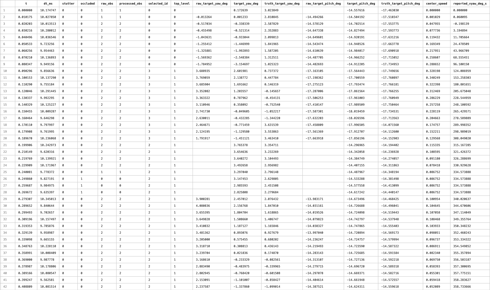
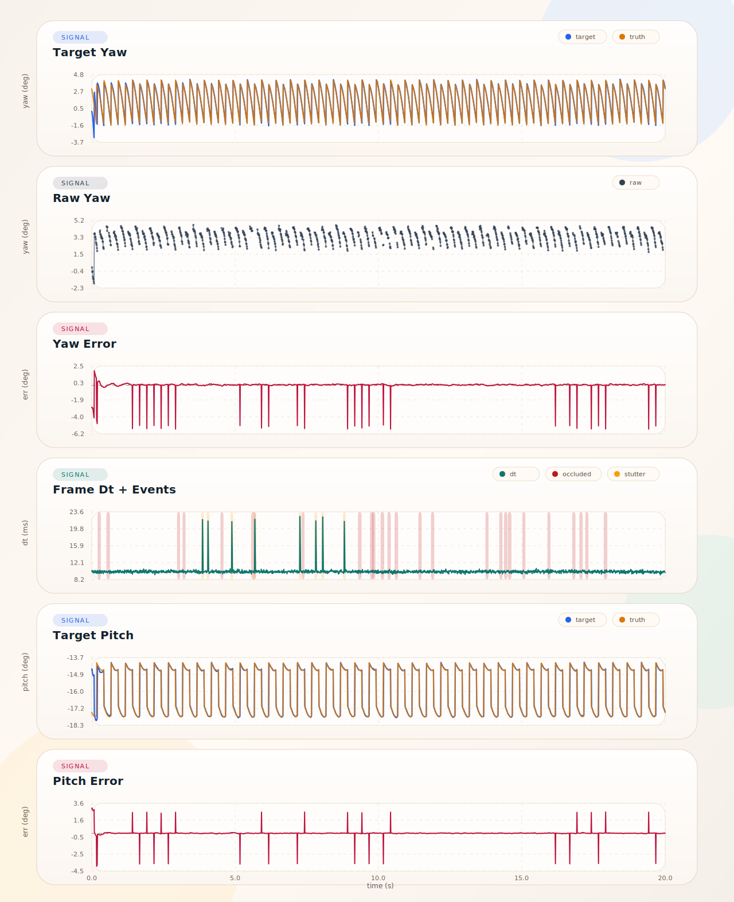

# Simulator 说明

当前入口：

- `./autoaim_simulator/run_simulator.sh`
- `./autoaim_simulator/simulator.cpp`

## 1. 怎么运行

```bash
./autoaim_simulator/run_simulator.sh --tracker all --preset medium_disturb
```

参数说明：

```bash
./autoaim_simulator/run_simulator.sh --help
```


## 2. 预设

### 目标运动预设

| 预设 | 描述 | 具体数值 |
|------|------|----------|
| `translate_const` | 左右匀速平移 | vy = ±1.0 m/s |
| `translate_var` | 左右变速平移 | vy = -2.0 → 2.0 → -2.0 m/s |
| `spin_const` | 匀速陀螺 | vyaw = 60 rpm = 2π rad/s = 360 deg/s |
| `spin_var` | 变速陀螺 | vyaw = 20 → 120 → 60 rpm |
| `spin_const_translate_const` | 匀速陀螺 + 左右匀速平移 | vyaw = 60 rpm, vy = ±0.8 m/s |
| `spin_var_translate_var` | 变速陀螺 + 左右变速平移 | vyaw = 30 → 120 → 60 rpm, vy = -1.5 → 1.5 → -1.5 m/s |
| `spin_const_height_var` | 匀速陀螺 + 原地高度变化 | vyaw = 60 rpm，高度 = 0 → 50 cm → 0，周期 5 s |
| `spin_var_height_var` | 变速陀螺 + 原地高度变化 | vyaw = 20 → 120 → 60 rpm，高度 = 0 → 40 cm → 0，周期 5 s |
| `outpost_standard` | 固定前哨站 | vyaw = 0.8π rad/s 附近轻微波动 |

### 扰动预设

| 预设 | 描述 |
|------|------|
| `clean` | 低噪声，无丢帧，无卡顿，自车扰动极小 |
| `light_disturb` | 轻度噪声、轻度丢包遮挡卡顿、轻微溜车 |
| `medium_disturb` | 常规噪声、常规丢包遮挡卡顿、明显溜车 |
| `heavy_disturb` | 更重噪声、更多丢包遮挡卡顿、更大溜车 |
| `extreme_disturb` | 极端综合干扰 |

默认仿真时长是 `20s`

## 3. 常用启动命令

### simple / singer 平移目标

```bash
# SimpleTracker，左右匀速平移 1.0m/s + 轻度扰动
./autoaim_simulator/run_simulator.sh --tracker simple --standard-mode translate_const --preset light_disturb

# SingerTracker，左右匀速平移 1.0m/s + 轻度扰动
./autoaim_simulator/run_simulator.sh --tracker singer --standard-mode translate_const --preset light_disturb

# SimpleTracker，左右变速平移 -2.0~2.0~-2.0m/s + 中度扰动
./autoaim_simulator/run_simulator.sh --tracker simple --standard-mode translate_var --preset medium_disturb

# SingerTracker，左右变速平移 -2.0~2.0~-2.0m/s + 中度扰动
./autoaim_simulator/run_simulator.sh --tracker singer --standard-mode translate_var --preset medium_disturb
```

### top 陀螺目标

```bash
# TopTracker，匀速陀螺 60rpm + 轻度扰动
./autoaim_simulator/run_simulator.sh --tracker top --top-mode spin_const --preset light_disturb

# TopTracker，变速陀螺 20~120~60rpm + 中度扰动
./autoaim_simulator/run_simulator.sh --tracker top --top-mode spin_var --preset medium_disturb

# TopTracker，匀速陀螺 60rpm + 左右匀速平移 0.8m/s + 轻度扰动
./autoaim_simulator/run_simulator.sh --tracker top --top-mode spin_const_translate_const --preset light_disturb

# TopTracker，变速陀螺 30~120~60rpm + 左右变速平移 -1.5~1.5~-1.5m/s + 中度扰动
./autoaim_simulator/run_simulator.sh --tracker top --top-mode spin_var_translate_var --preset medium_disturb

# TopTracker，匀速陀螺 60rpm + 原地高度变化 0~50cm~0（周期5s）+ 轻度扰动
./autoaim_simulator/run_simulator.sh --tracker top --top-mode spin_const_height_var --preset light_disturb

# TopTracker，变速陀螺 20~120~60rpm + 原地高度变化 0~40cm~0（周期5s）+ 中度扰动
./autoaim_simulator/run_simulator.sh --tracker top --top-mode spin_var_height_var --preset medium_disturb
```

### top3 前哨站目标

```bash
# Top3Tracker，固定前哨站 + 中度扰动
./autoaim_simulator/run_simulator.sh --tracker top3 --preset medium_disturb
```

### 自定义参数

```bash
# 指定距离和弹速
./autoaim_simulator/run_simulator.sh --tracker top3 --preset medium_disturb --distance-m 7 --bullet-speed 13.5

# 四个 tracker 一起跑综合压力
./autoaim_simulator/run_simulator.sh --tracker all --standard-mode translate_var --top-mode spin_var_translate_var --preset heavy_disturb
```

你也可以在扰动 preset 基础上继续覆写单个参数，比如：

```bash
./autoaim_simulator/run_simulator.sh \
  --tracker simple \
  --preset heavy_disturb \
  --fps 120 \
  --drop-prob 0.08 \
  --stutter-prob 0.06
```

## 4. 关键参数

### Tracker 选择

- `--tracker all|simple|singer|top|top3`

### 模式选择

- `--standard-mode translate_const|translate_var`
- `--top-mode spin_const|spin_var|spin_const_translate_const|spin_var_translate_var|spin_const_height_var|spin_var_height_var`
- `--outpost-mode outpost_standard`

### 仿真参数

- `--preset clean|light_disturb|medium_disturb|heavy_disturb|extreme_disturb`
- `--fps <value>`
- `--duration <seconds>`
- `--seed <int>`
- `--image-delay-ms <value>`
- `--imu-delay-ms <value>`
- `--imu-yaw-bias-deg <value>`
- `--imu-pitch-bias-deg <value>`
- `--drop-prob <value>`
- `--drop-min-frames <int>`
- `--drop-max-frames <int>`
- `--stutter-prob <value>`
- `--stutter-mult <value>`
- `--dt-jitter-ratio <value>`
- `--pos-xy-sigma <m>`
- `--pos-z-sigma <m>`
- `--yaw-sigma-deg <value>`
- `--corner-sigma <pixel>`

### 目标参数

- `--distance-m <value>`
- `--bullet-speed <m/s>`
- `--latency-ms <value>`
- `--params-file <path>`

### 输出

- `--output-dir <path>`

默认距离和弹速分三类：

- `simple / singer`：默认 `1.5m`，默认 `22.8m/s`
- `top`：默认 `3.0m`，默认 `22.8m/s`
- `top3 / outpost`：默认 `5.0m`，默认 `11.8m/s`

## 5. 输出内容

默认输出目录：

```bash
./autoaim_simulator/output
```

每个场景会输出两类文件：

- `*.csv`
- `*.svg`

csv示例：



图片示例：



## 6. 项目文件复用

### 卡尔曼 / tracker 预测

- `../autoaim_armor_predictor/src/tracker/SimpleTracker.cpp`
- `../autoaim_armor_predictor/src/tracker/SingerTracker.cpp`
- `../autoaim_armor_predictor/src/tracker/TopTracker.cpp`
- `../autoaim_armor_predictor/src/tracker/Top3Tracker.cpp`

### 弹道

- `../autoaim_utilities/src/BulletTrajectory.cpp`
- `../autoaim_utilities/include/autoaim_utilities/BulletTrajectory.hpp`

### yaw 优化

- `../autoaim_utilities/src/YawOptimizer.cpp`
- `../autoaim_utilities/include/autoaim_utilities/YawOptimizer.hpp`

### 参数来源

- `../autoaim_bring_up/config/node_params.yaml`

## 7. 可模拟场景

- 可调帧率
- 可调目标距离
- 可调弹速
- 左右匀速平移 1.0 m/s
- 左右变速平移 -2.0 ~ 2.0 ~ -2.0 m/s
- 匀速陀螺 60 rpm
- 变速陀螺 20 ~ 120 ~ 60 rpm
- 匀速陀螺 + 左右匀速平移
- 变速陀螺 + 左右变速平移
- 匀速陀螺 + 原地高度变化 0 ~ 50 cm ~ 0
- 变速陀螺 + 原地高度变化 0 ~ 40 cm ~ 0
- 固定前哨 3 板
- IMU / 图像轻微不匹配
- 上游位置、yaw、角点噪声
- 随机遮挡导致的短时丢失
- 系统卡顿导致的帧间延时升高
- 自车小幅溜车 / 摆头 / 抬头带来的观测扰动


## 8. 说明

- 本工具不依赖 ROS
- 默认依赖 `clang++`、`Eigen`、`OpenCV core`
- 默认图像由 `simulator` 直接快速生成 `SVG`
- 强制重编译可加 `--rebuild`
- `node_params.yaml`、`TopTracker`、`BulletTrajectory`中的更改会直接反映到仿真中
- `Observer`中的更改无法直接反映到仿真中，需要在 `simulator.cpp` 里同步改动
